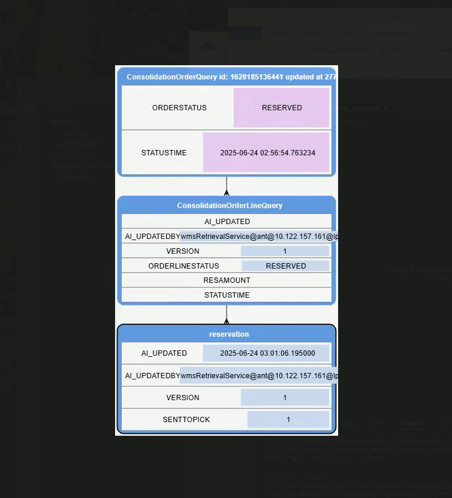

--
layout: default
---

<script
    src="https://code.jquery.com/jquery-4.0.0.slim.min.js"
    integrity="sha256-8DGpv13HIm+5iDNWw1XqxgFB4mj+yOKFNb+tHBZOowc="
    crossorigin="anonymous">
</script>

<script data-goatcounter="https://maxdurbin.goatcounter.com/count"
        async src="//gc.zgo.at/count.js"></script>

<script src="/maxdurbin/assets/js/renderTable.js"></script>
<script type="module" src="/maxdurbin/assets/js/obs_example.js"></script>

## **Software Support Engineer**
***Working at Schaefer Systems International (SSI) since 2022***

Hello, I'm max - A software support Engineer experienced with Python/SQL and problem solving.
Our team of two uses Python, SQL, JS, and CSS to write reports, scripts,
and maintain our system. We do some development on an internal diagnostics site 
and monitor critical services and processes to keep our automated warehouse running.

<div class="video">
 <iframe width="560" 
     height="315" 
     src="https://www.youtube.com/embed/8ypcAtJOHbI?si=JMTbLQdDpypjjka2"
     title="YouTube video player"
     frameborder="0"
     allow="accelerometer; autoplay; clipboard-write; encrypted-media; gyroscope; picture-in-picture;" 
     referrerpolicy="strict-origin-when-cross-origin" allowfullscreen>
 </iframe>
</div>

<div class="container" style="height:250px;">
 <div class="row row-12">
  <div class="col-7">
   <p>
      Working at Schaefer has been a great learning opportunity.
      At this point I'd like to find a team that can provide feedback and practice
      towards better organization and software architecture.
   </p>
   <a href="assets/MaxDurbinResume5.pdf">Resume pdf</a>
  </div>
  <div class="col-1"></div>
  <div style="text-align: right;" class="col-4">
   
  </div>
</div>
</div>

---

## Updating Our Diagnostics Site

Our site was built one month in 2011 due to a deadline, this caused issues.
Working on it has become one of my favorite activities.
Restructuring the site enabled us to rapidly build pages from wire frame concepts. 

The greatest impact was from standardizing components and defining a grid layout based on Bootsrap.

<!-- we should be able to escape this section-->


<div style="height:25px;"></div>

The [bootstrap grid](https://getbootstrap.com/docs/5.3/layout/grid/) layout above was defined like this. 
Additional Row classes allow for full vertical control.

<!--needs css for syntax highlighting-->
```html
<div class='container' style='height:200px;'>
 <div class='row row-12'>
  <div id='table_ex0' class='col-4'></div>
  <div id='myplot' class='col-4'></div>
  <div class='col-4 subGrid'>
   <div class='row row-6'>
    <div id='table_ex2' class='col-8'></div>
    <div id='table_ex3' class='col-4' style='--dc-default-blue: firebrick;'></div>
   </div>
   <div class='row row-6'>
    <div id='table_ex4' class='col-12'></div>
   </div>
  </div>
 </div>
</div>
```
---
## Scripting

Our team gets exposed to a variety of problems, a result of our teamsize being two.
Recent examples -

* Find a variable in a Siemens PLC
* Analyse the cost of machine faults on production : statistics
* Automate a report pulling data from external legacy GUI : RPA + statistics

#### *A Recent Example*

In November I was asked to read log files containing byte messages 
we call telegrams to verify what a machine was being asked to do.
The telegrams are stored with other information reaching almost 400,000 lines per day.

Below our "case wheeler" machine is on the left.
In the picture the wheels are illuminated for a camera encased in a shroud directly above.
The feed is processed by a java service.

Now we can visualize and verify the messages being sent by our java service.
Red means break, 0 with a green underscore means the wheel will freely spin
and a numbered arrow asks the wheel to move some distance. 


<div class="container" style="aspect-ratio: 16/9;">
 <div class="row row-12">
  <div class="col-3">
   
  </div>
  <div class="col-9">
   
  </div>
 </div>
</div>

---

#### *Example.2 Sequence Mining*

In order to diagnose some data integrity issues we wanted to know

    1. what should have just happened. (change + service)
    2. what normally happens next. (change + service)

It's good to know how to push things forward/back a step and what service is supposed to do it.
 
I wrote a sequence mining algorithm with hierarchical handling.
It looks at a number of entities in our db that undergo the same process and records
changes that always happen in the same sequence.

All children must do something, parent does something, all children do something else.

A CLI lets us step forward and back through a process, overwriting an SVG.



---

### Getting familiar with Linux.

My practice with Linux comes from working on our server.
Mostly I'm viewing logs and restarting services. I enjoy learning about the
utilities on our server to work more efficiently.

Here I have a command that puts log lines in chronological order that might come from multiple rolling log files
from different directories. This could seem like overcomplicating a simple task, but putting everything in order and squishing out the spaces is very helpful.

`grep -r -h dlhaden | sort -k2,3 | cut --complement -b31-110 | tr -s ' ' | vim -R -`  

---

### Performance Monitoring Statistics

Our performance monitoring system enables incentivised pay for our high performing users.
We give our users 'assignments' ranging from 2 to 60 seconds throughout the day.

We recently had a complication where for one week our site wide performance decreased significantly.
We needed to break down and measure the influencing factors to identify a misadjustment
that was exacerbated due to the type of stock we were shipping for the week.

This required imagining factors that could influence performance and grouping the assignments
based on those factors with weights proportional to the seconds each group donated.

By breaking down assignments as if to calculate a weighted average we were able to see which
factors really do effect performance and of those which saw an increase large enough during the week
to cause our issue.

---

### Location Button Test




---
<!-- do i need a footer?-->
<div style="height: 50px;"></div>
